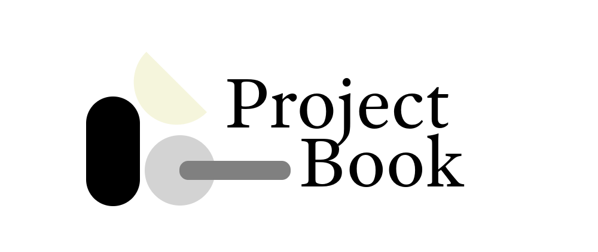

<div align="center">



# ProjectBook

**The open-source workspace where every task traces back to the user insight that justified it.**

Story → Problem → Idea → Task → Feedback — every link enforced, so you never lose the *why* behind what you build.

[](LICENSE)
[](https://github.com/MrEthical07/projectbook)
[](https://kit.svelte.dev)

[**Live app**](https://projectbook.dev) · [**Try the demo**](https://demo.projectbook.dev) · [**Docs**](docs) · [**Backend repo**](https://github.com/MrEthical07/projectbook-backend)

</div>

<!-- TODO (task: demo GIF): drop a 30–60s screen capture at docs/assets/demo.gif showing
     create story → link problem → idea → task → feedback → orphan flag, then embed it here:
     <p align="center"></p>
     Until it exists, the demo link above is the fallback. -->

---

## What is ProjectBook?

Most product work gets scattered across docs, boards, chat, and tickets — and the *reasoning* behind decisions gets lost along the way. Six months later nobody remembers why a feature exists or which user problem it was meant to solve.

ProjectBook is an **open-source design-thinking workspace** that fixes this by modeling product development as one connected chain of artifacts. A user **story** frames a real insight, a **problem** is drawn from it, an **idea** answers the problem, a **task** implements the idea, and **feedback** validates the outcome — and the tool *enforces* those links instead of leaving them optional. Every piece of work can be traced back to the user insight that started it.

It's self-hostable, Apache-2.0 licensed, and built on SvelteKit + Go.

## Why it's different

Notion, Linear, Jira, Miro, and Productboard all let you link things — *if you remember to*. ProjectBook makes the chain a first-class rule of the system:

- **Enforced lineage, not optional tags** — artifacts can't drift out of their context.
- **Orphans are surfaced, not hidden** — anything missing its upstream/downstream link is flagged (`isOrphan`) so gaps get closed before work moves forward.
- **Design Thinking as structure, not a label** — Empathize → Define → Ideate → Prototype → Test maps directly onto the routes and data model.
- **Answer "why are we building this?" instantly** — every task carries its idea, problem, and originating story with it.

## The chain

```
Empathize     Define        Ideate        Prototype     Test
   │             │             │             │            │
 Story  ──▶  Problem  ──▶    Idea    ──▶    Task   ──▶  Feedback
(persona,   (framed from   (answers a    (implements   (validates the
 research)   stories)       problem)      an idea)       outcome)
```

Supporting artifacts — **Journeys, Pages, Resources, Calendar** — add context without cluttering the chain.

## Features

- End-to-end traceability from user insight to validated outcome
- Enforced artifact relationships with orphan-state visibility
- Per-artifact editing with explicit save (no noisy autosave) and status workflows
- Table/Kanban task views, filters, assignees, deadlines
- Mask-based RBAC — fine-grained, per-domain permissions across the whole app
- Permission-aware UI: you never see a control the backend wouldn't allow
- Self-hostable; your data stays yours

## Screenshots

<!-- TODO (task: demo GIF / screenshots): add a few screenshots to docs/assets/ and embed here. -->
> A picture's worth more than this README — **[try the live demo](https://demo.projectbook.dev)**.

## Quickstart (development)

ProjectBook is two services: this SvelteKit web app and the [Go backend](https://github.com/MrEthical07/projectbook-backend) (Postgres + MongoDB + Redis). The web app needs a running backend to work.

```bash
pnpm install
pnpm run dev
```

Set the backend URL via environment variables (`PROJECTBOOK_API_BASE_URL`, `API_URL`). See [docs/development-guide.md](docs/development-guide.md) for the full setup, and the [backend repo](https://github.com/MrEthical07/projectbook-backend) for its services.

### Self-hosting (production)

Build and run the web image with runtime-injected config:

```bash
docker build -t projectbook-web:prod .
docker run --rm -p 3000:3000 \
  -e PROJECTBOOK_API_BASE_URL=http://host.docker.internal:8080/api/v1 \
  -e API_URL=http://host.docker.internal:8080 \
  -e NODE_ENV=production -e HOST=0.0.0.0 \
  projectbook-web:prod
```

The image bundles no secrets — all config is via env vars, and the backend is an external dependency. See the [backend repo](https://github.com/MrEthical07/projectbook-backend) for its setup.

> 🚧 A single `docker compose up` that boots the whole stack (web + API + Postgres + Mongo + Redis) with a seeded demo project is on the roadmap — it'll make self-hosting a two-minute affair.

## Tech stack

**Frontend:** SvelteKit · Svelte 5 (runes) · TypeScript · Vite · Zod · Tailwind CSS · shadcn-svelte
**Backend:** Go · PostgreSQL · MongoDB · Redis ([separate repo](https://github.com/MrEthical07/projectbook-backend))
**Auth:** [goAuth](https://github.com/MrEthical07/goAuth) — a custom Go auth engine (JWT + Redis sessions + bitmask RBAC)

## Architecture (for contributors)

ProjectBook favors explicit, traceable structure over flexibility. The frontend has **no service layer**: UI → route load → remote functions (`query()` / `command()`) → API layer → backend. Remote functions are the only read/write boundary, own Zod validation and permission checks, and send full-state snapshots (no partial patching). Permissions use bitmask `hasPerm` checks resolved from backend-issued context.

If you're contributing or curious about the internals (execution model, caching, tradeoffs, data flow), start here:

- [Architecture](docs/architecture.md)
- [Mental model](docs/mental-model.md)
- [Data flow](docs/data-flow.md)
- [Permissions](docs/permissions.md)
- [Remote functions](docs/remote-functions.md)
- [Development guide](docs/development-guide.md)

## Links

- **Live app:** https://projectbook.dev
- **Demo:** https://demo.projectbook.dev
- **Backend:** https://github.com/MrEthical07/projectbook-backend
- **Auth engine (goAuth):** https://github.com/MrEthical07/goAuth
- **Docs:** [docs/](docs)

## Contributing

Contributions welcome — see [CONTRIBUTING.md](CONTRIBUTING.md) and [docs/contribution-guide.md](docs/contribution-guide.md).

## License

Apache 2.0 — see [LICENSE](LICENSE).
