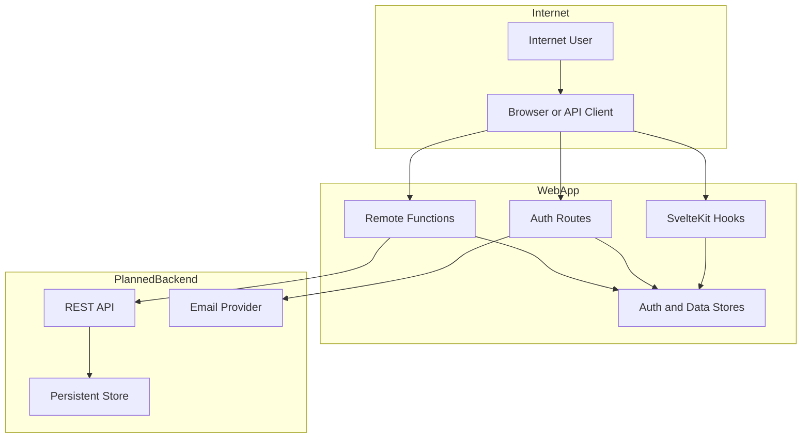

## Executive summary

This repository models an internet-exposed, multi-user, multi-tenant project workspace, but the current runtime implementation is not safe for that deployment model. The dominant risks are broken authorization in Svelte remote mutations, default superadmin bootstrapping with known credentials, and identity/tenant isolation being derived from global in-memory state rather than the authenticated session. The documented backend contract in `API-GUIDELINES.md:450-468` would reduce some of this risk if implemented faithfully, but the code that exists today in `src/lib/remote/*`, `src/hooks.server.ts`, and `src/lib/server/auth/*` leaves privilege escalation and cross-project compromise as the highest-priority manual review paths.

## Scope and assumptions

- In scope:
  - Runtime auth and session handling in `src/hooks.server.ts`, `src/lib/server/auth/*`, and `src/routes/auth/*`
  - Project-scoped reads and mutations in `src/lib/remote/*`
  - Client-side project access propagation in `src/routes/project/[projectId]/*`
  - Planned backend/API contract in `API-GUIDELINES.md` and `openapi.yaml`
- Out of scope:
  - UI-only component styling under `src/lib/components/ui/*`
  - Build/dev defaults in `README.md` unless they change runtime exposure
  - Infrastructure controls not visible in repo (CDN, WAF, TLS termination, DB network policy)
- Confirmed assumptions:
  - The app is intended for public internet exposure.
  - The system is multi-user and multi-tenant; one user can belong to multiple projects.
  - A persistent backend/provider layer will replace current in-memory stores, and the target contract is described in `API-GUIDELINES.md`.
- Implementation assumptions that still affect ranking:
  - The current Svelte remote layer is the active runtime client/server boundary because `svelte.config.js:12-19` enables remote functions and `API-GUIDELINES.md:466-508` calls that layer canonical.
  - The current repo does not yet implement the documented REST backend or persistent stores; `src/lib/server/auth/store.ts:17-23` and `src/lib/server/data/datastore.ts:50-99` are therefore treated as real runtime state for this review.
  - Browser security headers are not visible in repo code (`src/app.html:1-10`, `src/hooks.server.ts:13-46`), so header-based protections are treated as unknown rather than present.
- Open questions that would change some priorities:
  - How bearer tokens will be minted, signed, rotated, and revoked for API clients described in `API-GUIDELINES.md:104-112` and `openapi.yaml:62-79`
  - What hard tenant boundary the future persistent backend will use for project membership and artifact scoping

## System model

### Primary components

- Browser and API clients authenticate with either the `projectbook_session` cookie or future bearer tokens, per `API-GUIDELINES.md:84-135` and `openapi.yaml:62-79`.
- The SvelteKit web app performs session lookup and public-route gating in `src/hooks.server.ts:13-46`.
- Auth flows are handled by server actions in `src/routes/auth/+page.server.ts:41-107`, `src/routes/auth/forgot-password/+page.server.ts:10-24`, `src/routes/auth/reset-password/+page.server.ts:20-42`, and `src/routes/auth/verify/+page.server.ts:32-64`.
- Project data access and mutations currently go through Svelte remote functions in `src/lib/remote/*`; this matches the intended architecture in `API-GUIDELINES.md:466-508`.
- Auth state is stored in `authStore` (`src/lib/server/auth/store.ts:17-23`), and project/workspace state is stored in `datastore` (`src/lib/server/data/datastore.ts:50-99`).
- The repo also documents a future REST backend in `API-GUIDELINES.md` and `openapi.yaml`, but that backend is not implemented in the current codebase.

### Data flows and trust boundaries

- Internet user -> Auth routes (`/auth`, `/auth/verify`, `/auth/forgot-password`, `/auth/reset-password`)
  - Data: email, password, reset token, verification token, notice cookie
  - Channel: browser form POST/GET over HTTP(S)
  - Security guarantees: schema validation via Zod/superforms, process-local rate limiting, cookie issuance with `HttpOnly` and `SameSite=Strict` in `src/lib/server/auth/cookies.ts:5-20`
  - Validation: request schema checks in `src/routes/auth/+page.server.ts:43-46`, `src/routes/auth/reset-password/+page.server.ts:22-25`, and related files
- Browser with session cookie -> SvelteKit hook/session lookup
  - Data: `projectbook_session` cookie value
  - Channel: inbound request cookies
  - Security guarantees: hashed session lookup in `src/lib/server/auth/service.ts:184-194`; unauthenticated users redirected away from non-public routes in `src/hooks.server.ts:37-44`
  - Validation: no per-project authorization at this boundary
- Browser -> Svelte remote queries and mutations
  - Data: project IDs, artifact IDs, role changes, role permission masks, member `isCustom` toggles, member `permissionMask`, editor state, and caller-supplied `actorId`
  - Channel: Svelte remote-function RPC boundary
  - Security guarantees: some Zod validation on payload shape; intended future server-side authz per `API-GUIDELINES.md:450-468`
  - Validation: current implementation derives the actor permission mask server-side and authorizes with mask checks; `actorId` remains a high-sensitivity caller field for some artifact mutations
- Remote layer -> current in-memory stores
  - Data: auth sessions, users, project artifacts, role permission maps, invites, activity
  - Channel: in-process memory access
  - Security guarantees: none for tenant isolation beyond application logic
  - Validation: project existence checks such as `requireProjectId`, but no session-derived tenant boundary in many remote modules
- Remote layer -> planned REST API/backend
  - Data: all workspace/project operations listed in `API-GUIDELINES.md:466-586`
  - Channel: future server-to-server HTTP
  - Security guarantees: documented intent is authenticated, server-side permission checks on every request (`API-GUIDELINES.md:450-456`, `API-GUIDELINES.md:1316-1317`, `API-GUIDELINES.md:1670-1672`)
  - Validation: not present in current repo; treated as planned control, not an existing one
- Auth service -> email delivery/logging
  - Data: verification and password-reset links containing raw tokens
  - Channel: currently local auth email log and console output in `src/lib/server/auth/email.ts:13-30`
  - Security guarantees: tokens are hashed in storage before lookup, but outbound link handling is only mocked locally

#### Diagram

## Assets and security objectives

| Asset | Why it matters | Security objective (C/I/A) |
| --- | --- | --- |
| Session cookies, bearer tokens, reset tokens, verification tokens | Control user identity, password recovery, and session continuity across tenants | C/I |
| Project membership, roles, and permission matrices | Define who can view or mutate each tenant's project data | I/C |
| Project artifacts (stories, journeys, problems, ideas, tasks, feedback, resources, pages, calendar) | Core tenant data; cross-project disclosure or tampering harms customers directly | C/I |
| Workspace/project invite flows | Create new tenant access paths; abuse can onboard attackers or leak membership state | I/C |
| Activity and audit-style logs | Support detection, incident reconstruction, and accountability for privileged changes | I/A |
| Availability of auth endpoints and remote mutations | Login, reset, and core collaboration workflows are business-critical internet-facing entry points | A |

## Attacker model

### Capabilities

- Can reach the app over the public internet and interact with all public auth routes.
- Can create or use a normal account, obtain a valid session, and tamper with browser requests or remote-function payloads.
- Can enumerate or guess project slugs and artifact slugs because the API contract and UI routes are predictable (`API-GUIDELINES.md:145-150`, `openapi.yaml:83-139`).
- Can automate login, resend-verification, and password-reset traffic from multiple IPs or instances.
- Can read repository code or leaked builds, so hard-coded credentials and client-visible assumptions must be treated as known.

### Non-capabilities

- No pre-assumed shell access, database credentials, or control of infrastructure is required for the top-ranked threats.
- No cryptographic break of Argon2 or SHA-256 token hashing is assumed.
- No dependency on edge misconfiguration is required to exploit the current authz and bootstrap issues.
- No assumption is made that the future REST backend already exists or already enforces the documented controls.

## Entry points and attack surfaces

| Surface | How reached | Trust boundary | Notes | Evidence (repo path / symbol) |
| --- | --- | --- | --- | --- |
| Auth login/signup actions | Browser form POST to `/auth` | Internet -> server auth actions | Public endpoint; issues session cookies and exposes some account state | `src/routes/auth/+page.server.ts`, `src/lib/server/auth/service.ts` |
| Email verification and resend | GET/POST to `/auth/verify` | Internet -> server auth actions | Public token and resend flow; distinct user-facing errors | `src/routes/auth/verify/+page.server.ts` |
| Forgot/reset password | POST `/auth/forgot-password`, POST `/auth/reset-password` | Internet -> server auth actions | Public reset initiation and token redemption | `src/routes/auth/forgot-password/+page.server.ts`, `src/routes/auth/reset-password/+page.server.ts` |
| Session hook and route gating | Any non-public route request | Browser -> SvelteKit hook | Establishes authenticated user but not project authz | `src/hooks.server.ts` |
| Project access lookup | Layout load for `/project/{projectId}` | Browser -> remote query -> data store | Feeds role/permissions into client context | `src/routes/project/[projectId]/+layout.ts`, `src/lib/remote/access.remote.ts` |
| Team management mutations | Team members/roles pages | Browser -> remote mutations | Highest-impact project admin functions: invites, role changes, role permission mask changes | `src/routes/project/[projectId]/team/members/+page.svelte`, `src/routes/project/[projectId]/team/roles/+page.svelte`, `src/lib/remote/project.remote.ts` |
| Artifact mutations | Story/problem/page and other editor pages | Browser -> remote mutations | User-controlled content and status changes for tenant artifacts | `src/lib/remote/story.remote.ts`, `src/lib/remote/problem.remote.ts`, `src/lib/remote/page.remote.ts` |
| Planned REST API delegation | Future backend integration | Remote layer -> backend API | Intended secure boundary but not yet present | `API-GUIDELINES.md:466-586`, `openapi.yaml` |
| Verification/reset email side effect | Auth flows | Auth service -> logging/email provider | Raw links currently recorded locally; future provider will become external boundary | `src/lib/server/auth/email.ts` |

## Top abuse paths

1. Gain a normal user session with `member.edit`, intercept a team mutation request, tamper with submitted `permissionMask`/`isCustom` values in `updateProjectRolePermissions` or `updateProjectMemberPermissions`, and attempt to over-grant access through weak server-side validation.
2. Sign in with the seeded `admin@projectbook.com` / `admin` account, then use privileged project and team endpoints to modify memberships, permission matrices, or archive/delete tenant content.
3. Access project routes with any valid session and rely on the current global `datastore.workspace.user` resolution so the app treats the attacker as the same actor across projects, exposing or mutating data outside the attacker's real membership.
4. Tamper with artifact mutation requests such as `createStory`, `updateStory`, `createProblem`, or `updatePageEditor` to act as another user via `actorId` or to bypass per-domain edit/status restrictions with forged mask values where accepted.
5. Enumerate valid accounts by comparing auth, signup, and resend-verification responses, then target verified users with password-reset phishing or credential stuffing.
6. Spread login, resend, or reset traffic across multiple instances or after restarts so in-memory rate limits and auth state become inconsistent, enabling brute force, email flooding, or session instability.

## Threat model table

| Threat ID | Threat source | Prerequisites | Threat action | Impact | Impacted assets | Existing controls (evidence) | Gaps | Recommended mitigations | Detection ideas | Likelihood | Impact severity | Priority |
| --- | --- | --- | --- | --- | --- | --- | --- | --- | --- | --- | --- | --- |
| TM-001 | Authenticated tenant user | Any valid session and ability to tamper requests from the browser | Modify caller-supplied `actorId`, `isCustom`, or `permissionMask` values and invoke privileged mutations | Privilege escalation, unauthorized member/role changes, artifact tampering, project archive/delete | Authorization state, tenant data, invites, audit integrity | Server derives actor permission mask from request/session and enforces `hasPerm(...)`; payload shape validation | Some mutation payloads still include caller identity fields (`actorId`) that require strict server-side ownership checks | Derive actor identity exclusively from session where possible; keep mask validation centralized; add integration tests for role/member mask update boundaries and actor spoofing attempts | Alert on role/mask changes by non-admin actors; log actor, target member, old/new masks, and validation decisions | Medium | High | high |
| TM-002 | Internet attacker | Public reachability of the app | Log in using seeded default superadmin credentials | Immediate admin takeover of projects and future backend integration points | Auth artifacts, all tenant data, role configuration | Passwords are hashed with Argon2 in `src/lib/server/auth/password.ts:1-15`; auth cookie is `HttpOnly` in `src/lib/server/auth/cookies.ts:5-20` | Hard-coded bootstrap credentials in `src/lib/server/auth/constants.ts:10-12`; auto-seeding on first request in `src/hooks.server.ts:13-17` and `src/lib/server/auth/service.ts:293-309` | Remove default credentials; replace with operator-controlled one-time bootstrap; fail closed in production if bootstrap secret absent; rotate any previously used values | Alert on any login to bootstrap/admin account; record bootstrap events; block startup when default credentials are configured | High | High | critical |
| TM-003 | Authenticated tenant user | Any valid session and knowledge or discovery of target project IDs | Exploit global workspace identity and non-session-scoped project access to read or change data outside real membership | Cross-project and cross-tenant disclosure or mutation; broken tenant isolation | Tenant metadata, project artifacts, membership data | Hook enforces authentication on non-public routes in `src/hooks.server.ts:37-44`; API contract says project access should require membership in `API-GUIDELINES.md:1316-1317` and `API-GUIDELINES.md:1432-1435` | Current access resolution uses global `datastore.workspace.user` in `src/lib/remote/access.remote.ts:52-75` backed by `src/lib/server/data/datastore.ts:50-57`, not `event.locals.user` from `src/hooks.server.ts:21-33` | Bind all access resolution to session principal; enforce tenant scoping in persistent backend queries; deny out-of-scope `projectId` before data access; add cross-tenant isolation tests | Log project access with session user and resolved actor; alert on mismatches or repeated access to unknown project IDs | High | High | high |
| TM-004 | Unauthenticated internet attacker | Public auth endpoints | Enumerate emails and account state through distinct login/signup/resend responses | Better targeting for credential stuffing, phishing, and reset abuse | User identities, auth workflows, availability | Password policy in `src/lib/schemas/auth.schema.ts`; per-IP auth throttling in `src/lib/server/auth/rate-limit.ts:3-21`; forgot-password flow already returns a generic message in `src/routes/auth/forgot-password/+page.server.ts:20-24` | Login and verification responses expose account state in `src/routes/auth/+page.server.ts:57-65`, `src/routes/auth/+page.server.ts:95-98`, and `src/routes/auth/verify/+page.server.ts:50-60` | Normalize auth responses; keep specific reasons server-side only; add email and IP anomaly thresholds; consider CAPTCHA or challenge after repeated failures | Track many-email login attempts, resend bursts, and signup collisions; alert on enumeration patterns | Medium | Medium | medium |
| TM-005 | Internet attacker or botnet | Public auth endpoints and scaled deployment | Distribute requests across instances or wait for restarts to bypass in-memory rate limits and destabilize session state | Brute-force amplification, reset/resend mail flooding, forced reauthentication after restart | Auth availability, session continuity, reset/verification workflow | Hashed tokens in `src/lib/server/auth/service.ts:168-194`; process-local rate limits in `src/lib/server/auth/rate-limit.ts:3-21` | `authStore` and rate-limit state are in-memory only in `src/lib/server/auth/store.ts:17-23` and `src/lib/server/auth/rate-limit.ts:1-21`; this is inconsistent with production multi-instance use | Move sessions, reset tokens, verification tokens, and rate-limit counters to durable/shared storage; add per-account plus per-IP throttles; ensure restart-safe session revocation | Monitor auth attempts across nodes, session-miss spikes after deploys, and outbound email volume anomalies | High | Medium | high |
| TM-006 | Web attacker with a future injection or framing foothold | Any exploitable client-side injection or hostile embedding path | Use missing browser hardening to maximize session abuse, UI redressing, or content exfiltration | Increased blast radius of any future XSS or clickjacking issue | Session cookies, tenant data, user actions | `HttpOnly` cookies reduce direct JS cookie theft in `src/lib/server/auth/cookies.ts:5-20`; no dangerous HTML sinks were found in a targeted scan of `src/` | No visible CSP or other hardening headers in `src/app.html:1-10` or `src/hooks.server.ts:13-46`; edge protections are not visible in repo | Add or verify CSP, `X-Content-Type-Options`, clickjacking protection, and a restrictive `Referrer-Policy`; add response-header checks to CI | Runtime header checks, CSP reports, clickjacking/header regression tests | Medium | Medium | low |

## Criticality calibration

- `critical`
  - Tenant-wide or app-wide compromise with low attacker cost.
  - Examples:
    - Logging in with the seeded superadmin account and taking over projects.
    - Tampering with remote-function `permissionMask` or `isCustom` values to modify role defaults or archive/delete a project.
- `high`
  - Cross-tenant read/write exposure or control of integrity-critical state that still requires a valid user session or some additional step.
  - Examples:
    - Accessing another tenant's project through global identity confusion in `getProjectAccess`.
    - Bypassing distributed auth protections because sessions and throttles are per-process only.
- `medium`
  - Real abuse that materially improves attacker success or causes contained operational impact, but does not directly yield full tenant compromise on its own.
  - Examples:
    - Enumerating verified accounts through distinct auth error messages.
    - Flooding resend/reset flows to harass users or strain support operations.
- `low`
  - Defense-in-depth gaps whose severity depends on another vulnerability or missing infrastructure control.
  - Examples:
    - Missing visible CSP/header hardening when no direct XSS sink is currently evident.
    - Documentation or backend contract drift between the remote layer and future REST implementation.

## Focus paths for security review

| Path | Why it matters | Related Threat IDs |
| --- | --- | --- |
| `src/hooks.server.ts` | Global auth hook seeds admin, resolves sessions, and gates all non-public routes | TM-002, TM-003, TM-006 |
| `src/lib/server/auth/constants.ts` | Defines bootstrap credentials and token/session TTLs | TM-002 |
| `src/lib/server/auth/service.ts` | Central auth logic for sessions, verification, reset, and superadmin seeding | TM-002, TM-004, TM-005 |
| `src/lib/server/auth/store.ts` | Shows all auth state is process-local memory | TM-005 |
| `src/lib/server/auth/rate-limit.ts` | Process-local throttling logic for public auth flows | TM-004, TM-005 |
| `src/lib/server/auth/email.ts` | Emits reset/verification links and defines the future email side-effect boundary | TM-004, TM-005 |
| `src/lib/remote/access.remote.ts` | Resolves project role and permissions; current tenant-isolation choke point | TM-003 |
| `src/lib/remote/project.remote.ts` | Highest-impact admin mutations for invites, roles, permission masks, archive, and delete | TM-001, TM-003 |
| `src/lib/remote/story.remote.ts` | Representative artifact mutation path with caller-supplied actor identity (`actorId`) | TM-001 |
| `src/lib/remote/problem.remote.ts` | Representative status/edit mutation path for project artifacts | TM-001 |
| `src/lib/remote/page.remote.ts` | Rich editor mutation path with high-sensitivity caller-controlled editor payloads | TM-001 |
| `src/routes/project/[projectId]/+layout.ts` | Loads project access for all project routes | TM-003 |
| `src/routes/project/[projectId]/+layout.svelte` | Pushes access and `permissionMask` context into downstream route UI | TM-001, TM-003 |
| `src/routes/project/[projectId]/team/members/+page.svelte` | Client call site for member `role` + `isCustom` + `permissionMask` updates | TM-001 |
| `src/routes/project/[projectId]/team/roles/+page.svelte` | Client call site for role permission-mask updates | TM-001 |
| `src/routes/project/[projectId]/stories/+page.svelte` | Sends `actorId` into story creation | TM-001 |
| `src/routes/project/[projectId]/stories/[slug]/+page.svelte` | Sends editor state into artifact update/status flows | TM-001 |
| `API-GUIDELINES.md` | Documents the intended production backend trust model and server-side permission expectations | TM-001, TM-003, TM-005 |
| `openapi.yaml` | Documents exposed API surfaces, auth schemes, and resource identifiers for future backend integration | TM-003, TM-005 |

Checklist:
- Covered entry points discovered in repo: auth actions, route hook/session lookup, project access load, remote queries/mutations, and auth email side effects.
- Represented each major trust boundary at least once in threats: internet -> auth, browser -> remote layer, remote layer -> state stores/backend, auth service -> email delivery.
- Kept runtime risk separate from planned backend controls: current `src/` implementation is treated as active; `API-GUIDELINES.md` and `openapi.yaml` are treated as intended future controls only.
- Reflected your clarifications: public internet deployment, multi-user multi-tenant usage, and a future persistent backend/provider setup.
- Remaining open questions are explicit: bearer-token lifecycle and exact tenant-scoping model in the future persistent backend.
